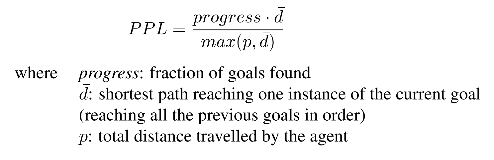

# MultiON Challenge 2024

This repository contains submission guidelines and starter code for the MultiON Challenge 2024. For challenge overview, check [challenge webpage](http://multion-challenge.cs.sfu.ca). To participate, visit EvalAI challenge [page](https://eval.ai/web/challenges/challenge-page/2276/overview).

To receive challenge updates, please join our Google Group email list: [click here](https://groups.google.com/g/multion-challenge-2023) to join or send an email to [multion-challenge-2023+subscribe@googlegroups.com](mailto:multion-challenge-2023+subscribe@googlegroups.com).

## Task 

In MultiON, an agent is tasked with navigating to a sequence of objects. These objects are placed into a realistic 3D environment. The task is based on the [AI Habitat](https://aihabitat.org/) and [Habitat Synthetic Scenes Dataset (HSSD)](https://3dlg-hcvc.github.io/hssd/) scenes.
                
Each episode contains 3 target objects randomly sampled from the objects present in the scene. Unlike previous challenges, this time the objects are described by a language instruction such as ‘Find the mantel clock on the chest of drawers’ instead of an object category. Moreover, the set of goal objects is not known apriori, making it closer to a real-world setting where the agent might be asked to ‘any’ object in the environment.
Each language instruction may contain a coarse description of the object (‘Go to the candle’) or a fine-grained description (‘Find the mini spa candle’). In the case of the former, there might exist multiple valid goal objects and navigating to any of them is considered successful. Instructions may also contain spatial relations between objects such as ‘Find the red short pillar candle on the grey nightstand’.

In summary, in each episode, the agent is initialized at a random starting position and orientation in an unseen environment and provided a sequence of 3 target objects. The agent must navigate to each target object in the sequence (in the given order) and call the FOUND action to indicate discovery. The agent has access to an RGB-D camera and a noiseless GPS+Compass sensor. GPS+Compass sensor provides the agent's current location and orientation information relative to the start of the episode.

## Dataset
We use [Habitat Synthetic Scenes Dataset (HSSD)](https://3dlg-hcvc.github.io/hssd/) for the challenge. Each episode contains 3 sequential targets described by natural language instructions.

## Evaluation

The episode terminates when an agent discovers all objects in the sequence of the current episode or when it calls an incorrect FOUND action. A FOUND action is incorrect if it is called when the agent is not within 0.5m from its current target object viewpoints (sampled around the goal centroid). Note that this does not require the agent to be viewing the object at the time of calling FOUND. After the episode terminates, the agent is evaluated using the Progress and PPL metrics that are defined below.  
**Progress**: Fraction of object goals that are successfully FOUND. This effectively measures if the agent was able to navigate to goals.  
**PPL**: Overall path length weighted by progress. This effectively measures the path efficiency of the agent. Formally, 



## Submission Guidelines 

To participate in the challenge, visit our [EvalAI](https://eval.ai/web/challenges/challenge-page/2276/overview) page. Participants need to upload docker containers with their agents using EvalAI. Before making your submission, you should run your container locally on the minival data split to ensure the performance metrics match with those of remote evaluation. We provide a base docker image and participants only need to edit `evaluate.py` file which implements the navigation agent. Instructions for building your docker container are provided below.


1. Install [nvidia-container-toolkit](https://github.com/NVIDIA/nvidia-container-toolkit) by following instructions given [here](https://docs.nvidia.com/datacenter/cloud-native/container-toolkit/latest/install-guide.html).

2. Clone this repository: 
```
git clone https://github.com/3dlg-hcvc/multion-challenge.git
cd multion-challenge
```
3. Edit `evaluate.py` to implement your agent. Currently, it uses an agent taking random actions.

4. Make changes in the provided `Dockerfile` if your agent has additional dependencies. They should be installed inside a conda environment named `habitat` that already exists in our docker.

5. Build the docker container (this may need `sudo` priviliges).

```
docker build -f Dockerfile -t multi_on:latest .
```

Note that we use `configs/multinav.yaml` as the configuration file. We use v0.2.5 for both [habitat-sim](https://github.com/facebookresearch/habitat-sim) and [habitat-lab](https://github.com/facebookresearch/habitat-lab).

6. Download scenes [Habitat Synthetic Scenes Dataset (HSSD)](https://3dlg-hcvc.github.io/hssd/) and place the data in: `multion-challenge/data/scene_datasets/hm3d`. 

Extract them under `multion-challenge/data`.

Download the dataset.

```
wget -O train.zip "https://aspis.cmpt.sfu.ca/projects/langmon/train"
wget -O val.zip "https://aspis.cmpt.sfu.ca/projects/langmon/val"
wget -O minival.zip "https://aspis.cmpt.sfu.ca/projects/langmon/minival"
```

Extract them and place them inside `multion-challenge/data` in the following format:

```
multion-challenge/
  data/
    scene_datasets/
      fphab/
          scenes/
          ...
    datasets/
        3_ON/
            train/
              content/
                  ...
              train.json.gz
            minival/
                content/
                    ...
                minival.json.gz
            val/
                content/
                    ...
                val.json.gz
```

7. Test the docker container locally.

```
./test_locally.sh --docker-name multi_on:latest
```
You should see an output like this:

```
2023-02-05 11:28:19,591 Initializing dataset MultiObjectNav-v1
2023-02-05 11:28:19,592 initializing sim Sim-v0
2023-02-05 11:28:25,368 Initializing task MultiObjectNav-v1
Progress: 0.0
PPL: 0.0
Success: 0.0
MSPL: 0.0
```

8. Install EvalAI and submit your docker image. See detailed instructions [here](https://cli.eval.ai/).

```
# Install EvalAI Command Line Interface
pip install "evalai>=1.3.5"

# Set EvalAI account token
evalai set_token <your EvalAI participant token>

# Push docker image to EvalAI docker registry
evalai push multi_on:latest --phase <phase-name>
```


## Citing MultiON Challenge 2024
If you use the multiON framework, please consider citing the following [paper](https://arxiv.org/pdf/2012.03912.pdf):
```
@inproceedings{wani2020multion,
    title       =   {Multi-ON: Benchmarking Semantic Map Memory using Multi-Object Navigation},
    author      =   {Saim Wani and Shivansh Patel and Unnat Jain and Angel X. Chang and Manolis Savva},
    booktitle   =   {Neural Information Processing Systems (NeurIPS)},
    year        =   {2020},
    }
```

## Acknowledgements
We thank the [habitat](https://aihabitat.org/) team for building the habitat framework and providing the HM3D scenes. We also thank [EvalAI](https://eval.ai/) team who helped us host the challenge.
